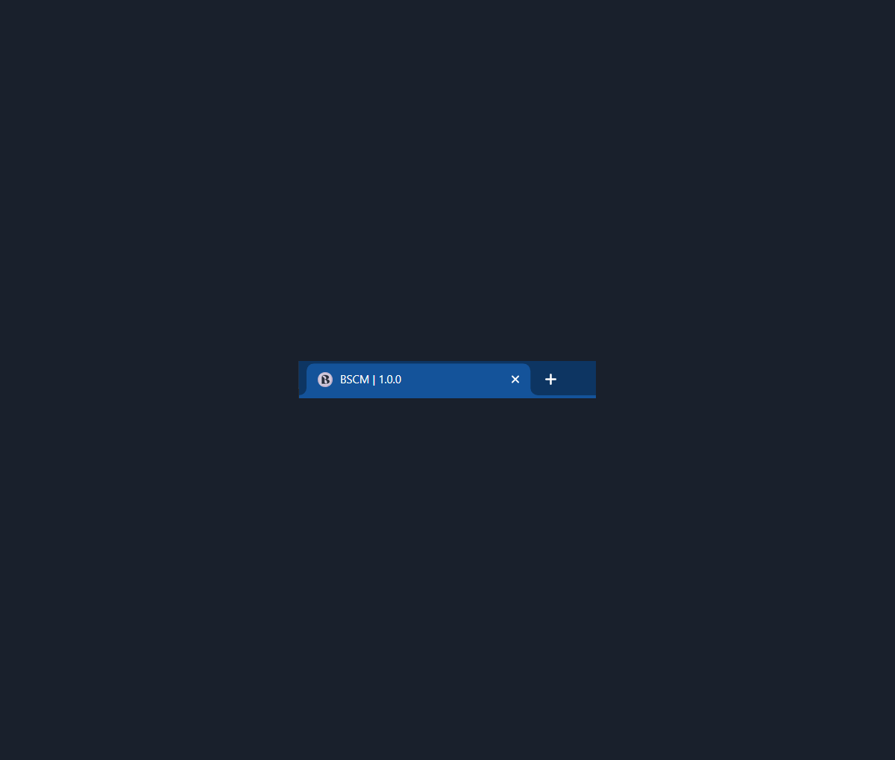

# A Blockchain Based Supply Chain Management System

## Dependencies
Built upon one of the Truffle boxes; [drizzle](https://trufflesuite.com/boxes/), which helps integrate ReactJs with blockchain smart contracts.

Tools and versions used -

- Node v16.15.0
- npm v8.5.5
- Ganache client v2.5.4
- Truffle v5.5.12
- Solidity v0.5.16
- Web3.js v1.5.3

Additionally, the frontend is powered by *material-ui* v4.x.

## Code Structure
The ReactJs part of the code goes under `appfrontend`, smart contracts under `contracts`, and migration configurations for these smart contracts under `migrations`.
Configurations for connecting to local blockchain - Ganache, and compiling the contracts are written in the `truffle-config.js` file.

Frontend uses the compiled contracts to interact with them. The compiled contracts are stored in `appfrontend/src/contracts/` (as configured in the `truffle-config.js` file), and are read internally in the `appfrontend/src/drizzleOptions.js` file. The expected contracts and events are configured here.

Frontend images for current state of the application are stored in the `images/currentstate` folder.

To know more about what's part of the frontend code, check out the README file in `appfrontend/`. 

## Getting Started

### Install the Required Dependencies

- Clone the project and run `npm install` in both the root and `appfrontend` folders. This should install most of the required dependencies. If a dependency conflict between react and material-ui versions pops up, install them forcefully with `npm install --force`.
- Additionally, install Truffle for managing contracts using `npm install truffle@5.5.12 -g`.
- Install the Ganache client from Truffle's [official website](https://trufflesuite.com/ganache/).
- Get the MetaMask browser extension. Create a test network that points to the local Ganache network, import the Ganache accounts into MetaMask and use them to access the application. Without MetaMask, the application takes the first Ganache address available.

### Configure the Project

- Open up Ganache and create a new workspace.
- Update `truffle-config.js` file with the workspace's network details. Connect the project to the workspace by linking the config file in the workspace's settings. 
- Use Truffle commands `truffle compile` and `truffle migrate` to compile and deploy the smart contracts to the new Ganache workspace. To deploy specifically to the `dev` environment, suffix `--network dev` to the above commands. Similarly, suffix `--network <network_name>` for any custom network names. 
- If updating any folder names in the frontend code, please note that the path for storing the compiled contracts needs to be modified in the `truffle-config.js` file.
- The migrations should successfully go through and the workspace should be updated with the contract deployment details.
 
For more commands, please refer to Truffle's [guides and tutorials](https://trufflesuite.com/docs/truffle/).

### Get the Frontend Running
Navigate to the `appfrontend` folder and run `npm start`. This should start the application and open it up in `localhost:3000`. Register with one of the MetaMask accounts as either a producer, distributor, or a retailer. 

 

## Current Functionalities
Currently uses the first available address to carry out these functionalities and works only for one producer, distributor and retailer user accounts. 

In general, users can -
- update the status of batches,
- view their basic profile details,
- view the batch details after creation,
- view active and sold (history) batches and their details.

Producers can create batches of products and the rest of the users can buy and sell them.

## Enhancements
Please check the repository's project board for ongoing and future enhancements.

## Target State

### Supply Chain Flow 

 

### User Actions

 

